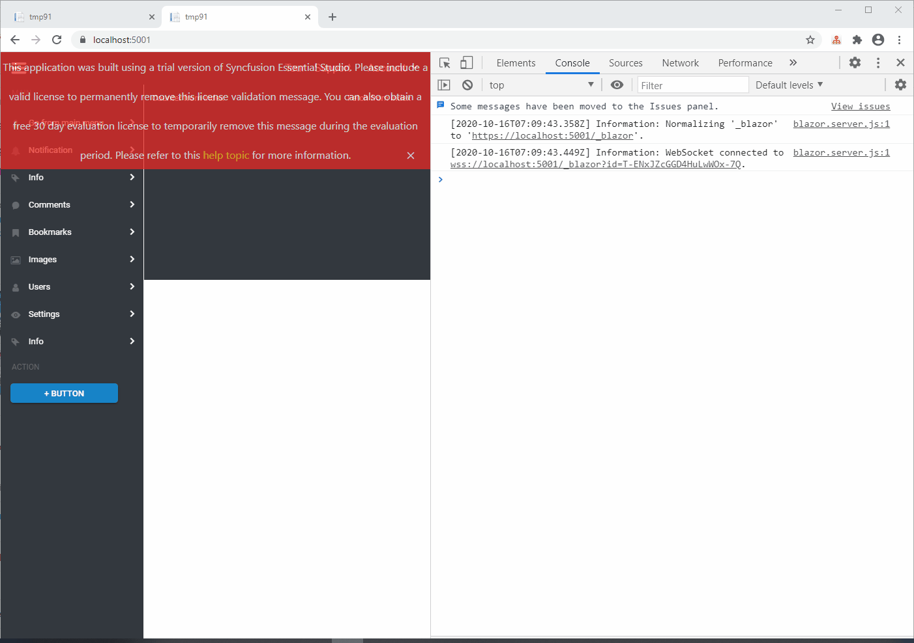

# SfmenuError

Just to check SF error.

Steps:

* Ensure you have dotnet sdk 5 rc
* Clone this repo
* Run app: `dotnet run --project blazor`
* Without stop app run test: `dotnet test`
* Wait until test fails
* Check for errors on console:

```
fail: Microsoft.AspNetCore.Components.Server.Circuits.CircuitHost[111]
      Unhandled exception in circuit 'E2sRhtgtLh0zcVfVsG24XFBmvF91lx0OqPHxkWNAYC4'.
      System.NullReferenceException: Object reference not set to an instance of an object.
         at Syncfusion.Blazor.Navigations.Internal.CreateMenuItem`2.MenuHoverHandler(TItem item)
         at Microsoft.AspNetCore.Components.ComponentBase.CallStateHasChangedOnAsyncCompletion(Task task)
         at Microsoft.AspNetCore.Components.RenderTree.Renderer.GetErrorHandledTask(Task taskToHandle)
```

